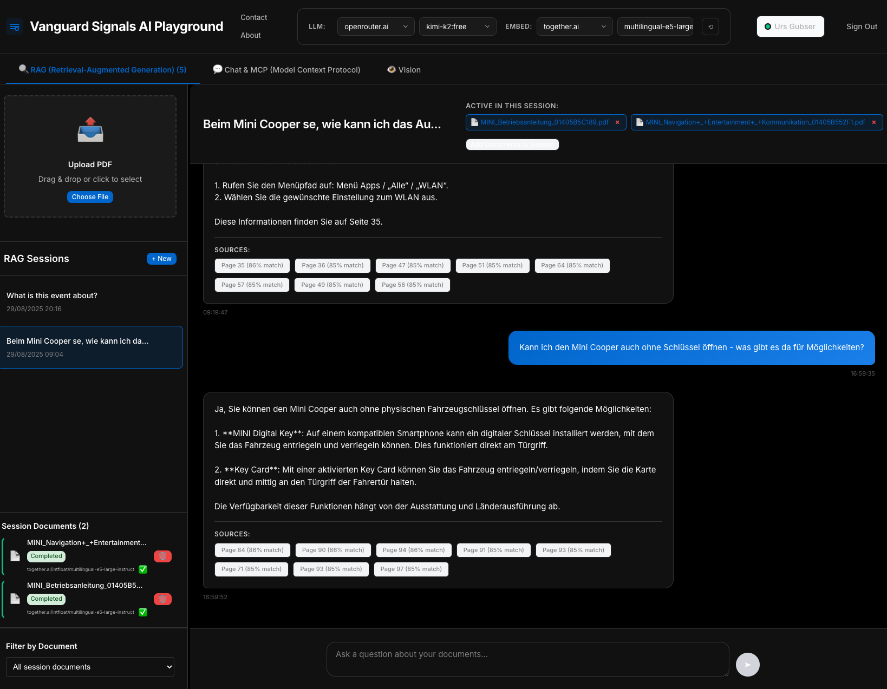
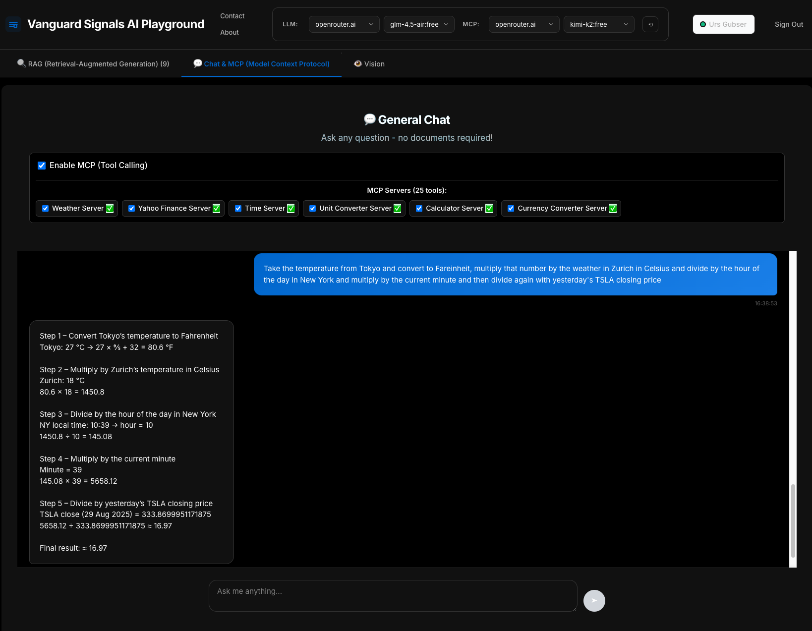
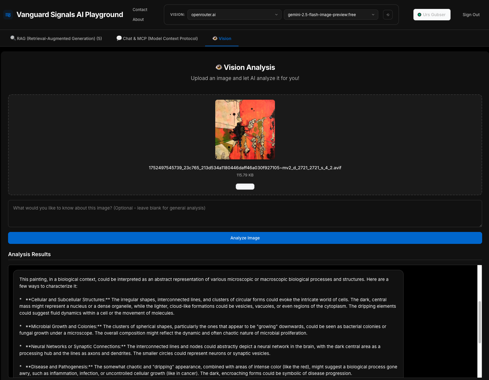

# AI Playground - User Instructions

## Overview

The Vanguard Signals AI Playground is a Firebase-powered RAG (Retrieval-Augmented Generation) chatbot application that provides three main AI interaction modes:

1. **RAG (Retrieval-Augmented Generation)** - Upload documents and ask questions about their content
2. **Chat & MCP (Model Context Protocol)** - General chat with tool-calling capabilities
3. **Vision Analysis** - Upload and analyze images with AI

## Model Selection System

### Understanding Model Types

The application uses different model types optimized for specific tasks:

- **LLM (Large Language Model)**: For text generation and conversation
- **EMBED (Embedding Model)**: For document vectorization and similarity search (RAG only)
- **MCP (Model Context Protocol)**: For models with tool-calling capabilities
- **VISION**: For image analysis and multimodal interactions

### Global Model Configuration

At the top of the interface, you can select:
- **LLM Provider**: Choose between OpenRouter.ai, Together.ai, or Ollama
- **Specific Model**: Select from available models for the chosen provider
- **Additional Settings**: Provider-specific configurations (EMBED for RAG, MCP for Chat)

## 1. RAG (Retrieval-Augmented Generation)

### Purpose
RAG allows you to upload PDF documents and ask questions about their content. The AI will search through your documents to provide accurate, context-aware answers.

### Step-by-Step Guide

#### Initial Setup
1. **Navigate to RAG Tab**: Click on "RAG (Retrieval-Augmented Generation)" in the main navigation
2. **Model Selection**:
   - **LLM**: Choose your preferred language model (e.g., "meta-llama/llama-4-maverick:free")
   - **EMBED**: Select an embedding model for document processing (e.g., "BAAI/bge-base-en-v1.5")

#### Document Upload
3. **Upload Documents**:
   - Click "Upload PDF" or drag and drop PDF files
   - Maximum file size: 50MB per document
   - Supported format: PDF only
   - Wait for processing completion (chunking and embedding generation)

#### Querying Documents
4. **Ask Questions**:
   - Type your question in the chat input
   - The AI will search relevant document sections
   - Responses include source citations with page numbers
   - View "SOURCES" section to see which document pages were referenced

#### Session Management
5. **Manage Sessions**:
   - Create new sessions with "+ New" button
   - Access previous sessions from the left sidebar
   - Filter sessions by document if needed

### Model Type Explanation for RAG

- **LLM Models**: Handle question answering and response generation based on retrieved context
- **EMBED Models**: Convert document text into vector embeddings for similarity search
  - `multilingual-e5-large-instruct`: Best for multilingual documents
  - `BAAI/bge-base-en-v1.5`: Optimized for English text, faster processing
  - `BAAI/bge-large-en-v1.5`: Higher accuracy for complex documents

## 2. Chat & MCP (Model Context Protocol)

### Purpose
Chat & MCP provides general conversational AI with powerful tool-calling capabilities through the Model Context Protocol. The AI can access external tools and services to provide enhanced functionality.

### Step-by-Step Guide

#### Initial Setup
1. **Navigate to Chat Tab**: Click on "Chat & MCP (Model Context Protocol)"
2. **Enable MCP**: Check "Enable MCP (Tool Calling)" checkbox
3. **Model Selection**:
   - When MCP is enabled, only **MCP-compatible models** are available
   - These models support function calling and tool integration
   - Recommended: "moonshotai/kimi-k2:free" or "meta-llama/llama-4-maverick:free"

#### Available MCP Tools
4. **Tool Selection**: The interface shows available MCP servers (25 tools):
   - ✅ **Weather Server**: Get current weather information
   - ✅ **Yahoo Finance Server**: Stock prices and financial data
   - ✅ **Time Server**: Current time and date operations
   - ✅ **Unit Converter Server**: Convert between different units
   - ✅ **Calculator Server**: Perform mathematical calculations
   - ✅ **Currency Converter Server**: Real-time currency exchange rates

#### Using MCP Chat
5. **Interact with Tools**:
   - Ask questions that require external data (e.g., "What's the weather in Tokyo?")
   - Request calculations (e.g., "Convert 100 USD to EUR")
   - Get financial information (e.g., "What's Tesla's current stock price?")
   - The AI will automatically call appropriate tools and integrate results

### Why MCP Models Are Special

**MCP (Model Context Protocol) Models** are specifically chosen for tool-calling because they:
- Support structured function calling syntax
- Can interpret tool schemas and parameters
- Reliably format tool calls according to specifications
- Handle tool response integration seamlessly

Regular LLM models without MCP support cannot reliably use external tools and may produce formatting errors.

## 3. Vision Analysis

### Purpose
Vision Analysis allows you to upload images and get detailed AI-powered analysis, descriptions, and insights about visual content.

### Step-by-Step Guide

#### Initial Setup
1. **Navigate to Vision Tab**: Click on "Vision" in the main navigation
2. **Model Selection**:
   - **VISION Provider**: Choose OpenRouter.ai or Together.ai
   - **Vision Model**: Select a multimodal model (e.g., "google/gemini-2.5-flash-image-preview:free")

#### Image Upload
3. **Upload Image**:
   - Click the upload area or drag and drop an image
   - Maximum file size: 10MB
   - Supported formats: JPG, PNG, GIF, WebP
   - Preview appears once uploaded

#### Image Analysis
4. **Analyze Content**:
   - **Optional Prompt**: Add specific questions about the image (leave blank for general analysis)
   - Click "Analyze Image" button
   - Receive detailed analysis in the "Analysis Results" section

#### Analysis Capabilities
5. **What Vision Models Can Do**:
   - Describe visual content and composition
   - Identify objects, people, text, and scenes
   - Interpret charts, graphs, and diagrams
   - Read text from images (OCR capabilities)
   - Analyze artistic styles and techniques
   - Answer specific questions about image content

### Vision Model Capabilities

**Vision Models** are multimodal AI systems that can:
- Process both text and image inputs simultaneously
- Understand spatial relationships and visual context
- Recognize and describe complex visual patterns
- Perform optical character recognition (OCR)
- Interpret scientific diagrams and data visualizations

Popular models include:
- `google/gemini-2.5-flash-image-preview:free`: Fast, accurate general vision analysis
- `meta-llama/llama-4-maverick:free`: Strong reasoning capabilities with vision
- `anthropic/claude-3.5-sonnet`: Excellent for detailed image analysis and creative interpretation

## General Features

### Model Provider Options

#### OpenRouter.ai
- Large selection of free and paid models
- High reliability and performance
- Supports all model types (LLM, MCP, VISION)

#### Together.ai
- Specialized in open-source models
- Good for embedding models
- Cost-effective for high-volume usage

#### Ollama (Local)
- Runs models locally on your machine
- Complete privacy and offline capability
- Requires local Ollama installation

### Session Management

- **Auto-save**: All conversations are automatically saved
- **Session History**: Access previous conversations from the sidebar
- **Session Naming**: Sessions are auto-named based on content
- **Cross-Feature Sessions**: Each mode (RAG, Chat, Vision) maintains separate session histories

### Tips for Best Results

#### For RAG:
- Upload well-formatted PDFs with clear text
- Ask specific questions about document content
- Use multiple documents for comprehensive knowledge base
- Check source citations to verify answer accuracy

#### For Chat & MCP:
- Be specific when requesting tool usage
- Combine multiple tool requests in one query
- Take advantage of real-time data capabilities

#### For Vision:
- Upload high-quality, clear images
- Provide specific questions for targeted analysis
- Use for OCR by asking to "read the text in this image"
- Experiment with creative interpretation requests

### Troubleshooting

#### Common Issues:
- **Model Not Responding**: Check if the selected provider is available
- **Tool Calls Failing**: Ensure MCP is enabled and MCP-compatible model is selected
- **Document Upload Errors**: Verify PDF is under 50MB and properly formatted
- **Image Analysis Errors**: Check image is under 10MB and in supported format

#### Performance Tips:
- Use free models for testing and experimentation
- Switch to paid models for production or high-volume usage
- Clear old sessions periodically to maintain performance
- Choose embedding models based on document language (multilingual vs English-only)

## Technical Requirements

- Modern web browser with JavaScript enabled
- Internet connection for cloud-based models
- For Ollama: Local installation and running instance
- Firebase account for authentication and data storage

---

*This AI Playground demonstrates the power of modern language models, embedding systems, and multimodal AI in a unified interface. Experiment with different models and features to discover the best combinations for your specific use cases.*